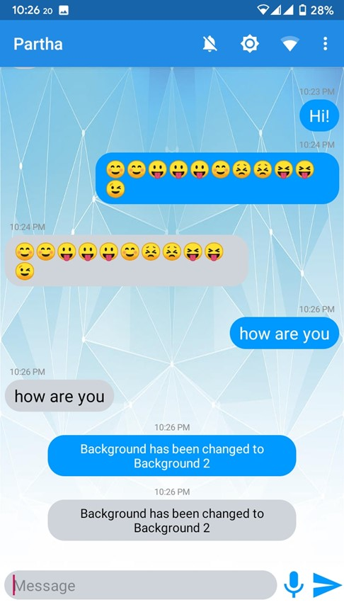

# P2P Messaging App

  

# Introduction
**P2P Messaging App** is a PEER-to-PEER android app built with Android Studio. 2 devices sharing same Wi-Fi network can communicate with each other through this application via socket programming.

**App Link**: [https://drive.google.com/file/d/1RLN6I5Nn_9h-AnjtWHgnHqvtfXlVqs40/view?usp=sharing](https://drive.google.com/file/d/1RLN6I5Nn_9h-AnjtWHgnHqvtfXlVqs40/view?usp=sharing)

## Some basic features:
-  Comfortable and familiar messenger like UI.
-  Option to change background image.
-  Textual file exchanging system.
-  Speech to text.
-  Dark mode.
-  Notification tone and Wi-Fi toggling system.

# Instruction
First, we need both the device connected to the same wifi network. The app won't work with mobile data. After running the app the user will be provided with a text field to provide a port address. The user must give a valid port number and click on the "Start Server" button. It's recommended to start the server from both the device after launching the app. After starting the server from both ends, the users can move to the next part. Now a user can give the IP address of the counterpart device and the corresponding port number to which the counterpart device opened a socket earlier. And after giving the IP address and port number user can press connect button. **THIS NEEDS TO BE DONE FROM BOTH THE DEVICES**. And then after the connection is established, users can chat and exchange text files!

# Screenshots
Here are some of the screenshots from the Application. To capture these screenshots, I was actually talking to myself by setting the target IP as “localhost” and target port as the same as the listening port! 

 
 
 
 
 